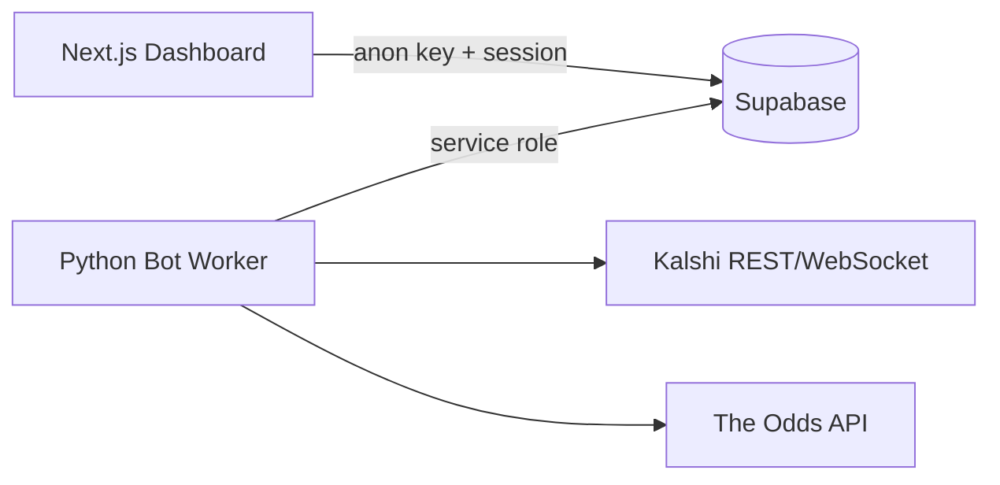

# Architecture

## System Overview



## Kalshi Demo vs Production API

Kalshi provides two API environments:

| Environment | Base URL | Use case |
|-------------|----------|----------|
| **Demo** | `demo-api.kalshi.co` | Plumbing tests — auth, loops, paper executor; limited market catalog |
| **Production** | `api.elections.kalshi.com` | Real markets (including World Cup); required for strategy validation |

Despite the "elections" subdomain, production serves **all** Kalshi markets. Demo rarely includes World Cup/soccer markets, so Phase 1 validates wiring only; Phase 2 switches to production while staying in paper mode. See [rollout-phases.md](rollout-phases.md).

## Three-Loop Bot Design

### 1. Fetcher Loop

- Reads active `market_mappings`, `matches`, and `bot_config`.
- Computes per-market polling interval from match proximity:
  - No match within 6h → 30 min
  - Match within 6h → 5 min
  - Match within 30m → 30 sec
  - Live match → 5 sec
- Fetches Kalshi prices (REST or WebSocket mode) and sportsbook odds.
- Writes normalized rows to `price_snapshots`.

### 2. Strategy Loop

- Reads recent snapshots per mapping.
- Converts sportsbook odds to fair probabilities (vig removal).
- Compares fair probability vs Kalshi bid/ask.
- Writes `signals` with edge, action, reason code, and lifecycle status.
- Exit signals on convergence.

### 3. Executor Loop

- Reads actionable `signals`.
- Enforces kill switch, paper/live mode, position limits, exposure caps.
- Paper mode: simulates orders/fills.
- Live mode: calls Kalshi V2 order APIs, reconciles fills.
- Full audit trail in `orders` and `fills`.

## Kalshi Market Data Modes

| Mode | Description |
|------|-------------|
| `polling` | REST fetcher with tiered scheduler (default) |
| `websocket` | Authenticated WebSocket stream with reconnect/resync |

Toggle via `bot_config.kalshi_market_data_mode`. WebSocket mode includes:
- Exponential backoff reconnect
- Resubscribe from active mappings
- Sequence gap detection + REST resync
- Fallback to polling on persistent failure

## Database Tables

| Table | Purpose |
|-------|---------|
| `profiles` | Single-user allowlist tied to auth.users |
| `matches` | World Cup schedule and live status |
| `bot_config` | Trading parameters, kill switch, mode toggles |
| `kalshi_markets` | Discovered Kalshi markets |
| `sportsbook_events` | Discovered Odds API events/outcomes |
| `market_mappings` | Manual Kalshi ↔ sportsbook links |
| `price_snapshots` | Timestamped price data |
| `signals` | Strategy outputs |
| `orders` | Order audit trail |
| `fills` | Fill audit trail |
| `worker_runs` | Bot heartbeat and health |

## Scheduler State Machine

Match status drives polling tier per mapped market:

```
scheduled (>6h)  → 1800s
scheduled (<6h)  → 300s
scheduled (<30m) → 30s
live             → 5s
finished         → 1800s (wind down)
```
