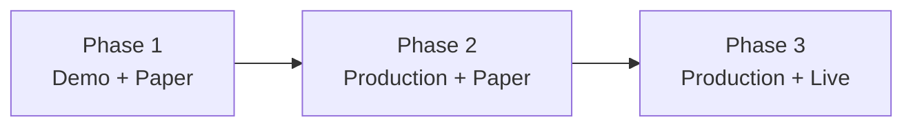

# KalshiBot Rollout Phases

This document is the **living operations plan** for how to run and validate KalshiBot after the initial build. It is separate from the original implementation plan (which describes what was built).

## Overview

Rollout happens in three deliberate phases. Do not skip ahead without meeting exit criteria for the current phase.

| Phase | Kalshi API | Trading mode | Purpose |
|-------|------------|--------------|---------|
| **1 — Plumbing** | Demo | Paper | Validate wiring, loops, dashboard, Supabase |
| **2 — Strategy validation** | Production | Paper | Real World Cup markets and prices, no real money |
| **3 — Live trading** | Production | Live | Real orders, small size, strict risk controls |



---

## Phase 1: Demo API — Plumbing (current default)

**Goal:** Prove the system runs end-to-end without touching real markets or real money.

### Environment (`apps/bot/.env`)

```env
KALSHI_BASE_URL=https://demo-api.kalshi.co/trade-api/v2
KALSHI_WS_URL=wss://demo-api.kalshi.co/trade-api/ws/v2
BOT_ENV=paper
```

### Dashboard `bot_config` (via `/dashboard/config`)

- `trading_mode` = **paper**
- `trading_enabled` = **false**
- `kill_switch` = **true**

### What to validate

- [ ] Supabase auth and allowlisted user login
- [ ] Dashboard pages load (mappings, config, worker, snapshots)
- [ ] Discovery script writes sportsbook outcomes to Supabase
- [ ] Bot worker starts and writes heartbeats to `worker_runs`
- [ ] Fetcher, strategy, and executor loops run without crashing
- [ ] Paper orders and fills appear in audit tables when signals fire
- [ ] Kill switch blocks execution when enabled

### What demo cannot validate

- World Cup market discovery (demo catalog rarely has soccer/WC markets)
- Real Kalshi prices for World Cup events
- Production order semantics on live tickers

Use **manual import** of any open demo market, or skip Kalshi-side testing until Phase 2. The Odds API side works on demo and production alike.

### Exit criteria (move to Phase 2 when all pass)

1. Bot runs for at least one session with stable heartbeats on all three loops
2. Dashboard mapping workflow works (create + approve a mapping)
3. Paper executor writes to `orders` and `fills` without errors
4. You understand how to switch env vars and redeploy

**Typical duration:** A few days of local/Railway testing.

---

## Phase 2: Production API + Paper Mode

**Goal:** Test the actual World Cup trading strategy against real Kalshi prices while still risking no capital.

### Environment changes (`apps/bot/.env` and Railway)

```env
KALSHI_BASE_URL=https://api.elections.kalshi.com/trade-api/v2
KALSHI_WS_URL=wss://api.elections.kalshi.com/trade-api/ws/v2
BOT_ENV=paper
```

Confirm your Kalshi API credentials are authorized for **production** (some accounts issue separate demo vs production keys).

Redeploy Railway after changing variables.

### Dashboard `bot_config`

- `trading_mode` = **paper** (unchanged)
- `trading_enabled` = **true** (allows signal processing; still paper fills)
- `kill_switch` = **true** (recommended until soak complete)

### Setup steps

1. Switch `KALSHI_BASE_URL` and `KALSHI_WS_URL` to production (above)
2. Redeploy bot on Railway
3. Run discovery: `python -m bot.scripts.discover_markets`
4. Import any missing markets: `python -m bot.scripts.import_kalshi_markets TICKER`
5. Map and approve markets in `/dashboard/mappings`
6. Deploy dashboard to Vercel if not already live

### What to validate

- [ ] Real World Cup Kalshi markets discovered or imported
- [ ] `price_snapshots` show live Kalshi + sportsbook prices for mapped markets
- [ ] `signals` generated with reasonable edges during pre-match / live windows
- [ ] Paper `orders` and `fills` reflect strategy behavior
- [ ] Scheduler tiers respond correctly (faster polling near kickoff / live)
- [ ] Kill switch halts new paper orders when toggled
- [ ] No unexpected errors in `worker_runs.last_error`

### Exit criteria (move to Phase 3 when all pass)

1. Paper soak over at least several match windows (pre-match + live)
2. Snapshots, signals, and paper fills behave as expected
3. Risk limits in `bot_config` reviewed and set conservatively
4. You have manually verified at least one full enter → exit paper cycle

**Typical duration:** Through multiple World Cup match days.

---

## Phase 3: Production API + Live Trading

**Goal:** Place real Kalshi orders with strict risk controls.

### Prerequisites (do not skip)

- Phase 2 paper soak completed successfully
- Kalshi account funded and production trading permissions confirmed
- `max_position_per_market`, `max_total_exposure`, `daily_loss_cap_cents` set conservatively
- Kill switch tested and known to work

### Environment

Same production URLs as Phase 2. No URL change required.

### Dashboard `bot_config` changes (deliberate, one at a time)

1. Confirm `trading_mode` = **live**
2. Set `trading_enabled` = **true**
3. Set `kill_switch` = **false** only when ready to trade

### What to validate

- [ ] First live order is small and matches intent
- [ ] `orders` and `fills` reconcile with Kalshi dashboard
- [ ] Kill switch immediately stops new orders when re-enabled
- [ ] Position and exposure limits enforced
- [ ] WebSocket mode (if enabled) stays healthy or falls back to polling

### Ongoing operations

- Monitor `/dashboard/worker`, `/dashboard/orders`, `/dashboard/fills`
- Keep kill switch accessible in `/dashboard/config`
- Review `daily_loss_cap_cents` before each match day
- Prefer extended paper re-soak after any config or code change

---

## Quick reference: env and config by phase

| Setting | Phase 1 | Phase 2 | Phase 3 |
|---------|---------|---------|---------|
| `KALSHI_BASE_URL` | demo | production | production |
| `BOT_ENV` | paper | paper | live |
| `bot_config.trading_mode` | paper | paper | live |
| `bot_config.trading_enabled` | false | true | true |
| `bot_config.kill_switch` | true | true → false when ready | false (keep handy) |

---

## Related docs

- [Setup Guide](setup.md) — service setup and env file locations
- [Architecture](architecture.md) — system design and demo vs production API
- [Security](security.md) — where secrets live (Kalshi keys on Railway/bot only)
